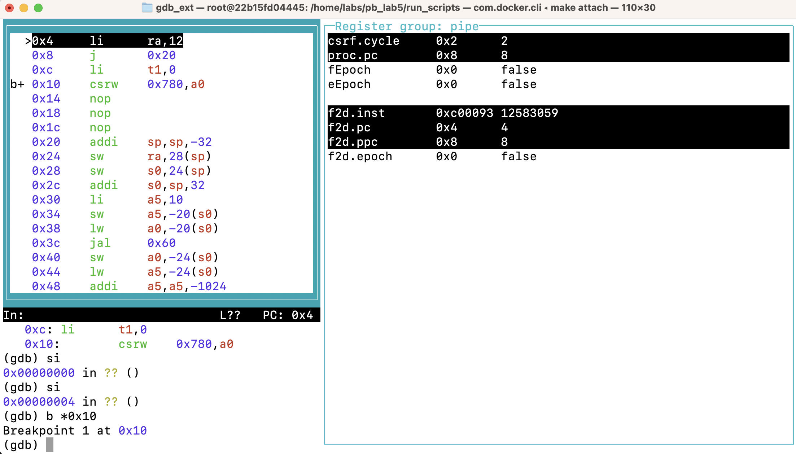
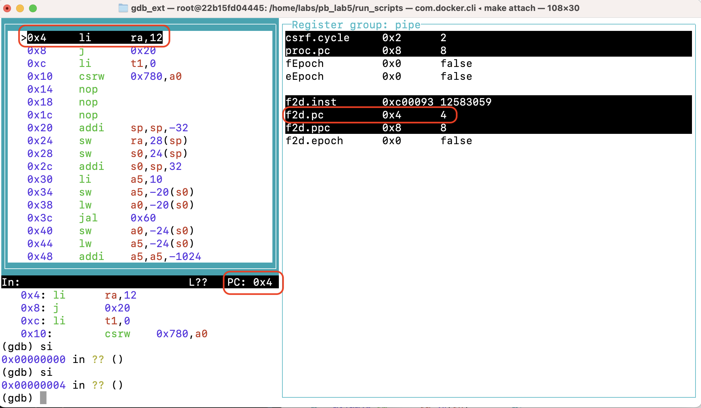
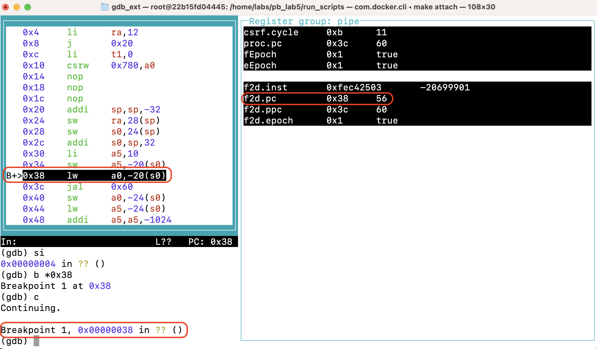
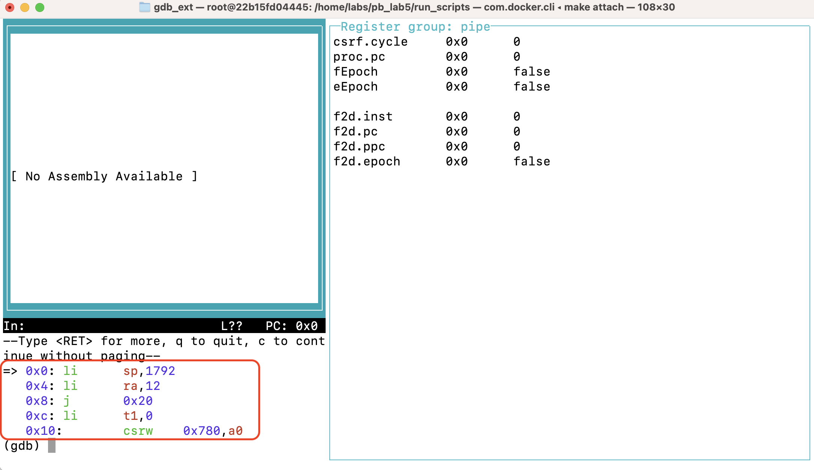

# Intro
This project offers a dedicated GDB(GNU Debugger) for effectively debugging RISV-V pipelined processors developed with Bluespec.

**Key Features:**
- **Easy Variable Inspection**: Effortlessly inspect custom variables defined within the processor.
- **Step Cycle Functionality**: Gain granular control over program execution with step cycle interpretation.
- **Breakpoints**: Set breakpoints to halt program execution at specific points for detailed examination.




Please note that this project currently supports debugging for Lab 5 and Lab 6.

## Table of Contents

- [Prerequisites](#prerequisites)
- [Installation](#installation)
- [Environment Setup](#environment-setup)
- [Usage](#usage)
    - [Running with Docker](#running-with-docker)
    - [Understanding run_scripts](#understanding-run_scripts)
    - [Initiating Debugging Session](#initiating-debugging-session)
    - [Using the Debugger](#using-the-debugger)
        - [TUI Settings Related](#tui-settings-related)
    - [Adding Custom Variables](#adding-custom-variables)
- [Tutorial](#tutorial)
- [Acknowledgements](#acknowledgements)


## Prerequisites
Before you begin, ensure you have the following prerequisites installed:
- [Bluespec Compiler](https://github.com/B-Lang-org/bsc)
- [riscv-gnu-toolchain](https://github.com/riscv-collab)
- Python 3.9
- libelf-dev

You can install Python 3.9 and libelf-dev using apt-get:


```bash
sudo apt-get update
sudo apt-get install python3.9 libelf-dev
```

## Installation
Follow these steps to build the gdbstub:

```bash
cd gdbstub
make XLEN=32 exe_gdbstub_tcp_tcp_RV32
```

## Environment Setup
To execute the debugger, ensure the following environment variables are configuired:
* `GDBSTUB`: This variable should point to the gdbstub folder.
Example:
```bash
export GDBSTUB=/home/gdbstub
```

* `TYPES_HELPER`: This variable should point to the type_helpers folder.
Example:
```bash
export TYPES_HELPER=/home/types_helper
```

## Usage
### Running with Docker
This project includes a Dockerfile as an example of a running environment. Follow these steps to use Docker:
1. Make sure you have Docker installed on your system. You can download and install Docker from [here](https://www.docker.com/get-started).

2. Build the Docker image using the provided dockerfile:
```bash
docker build -t riscv-gdb-debugger .
```
Please note that building the Docker image may take some time.

3. Run the Docker container with the following command:
``` bash
docker run -d --name gdb_container riscv-gdb-debugger
```

4. Open two terminal sessions, one for running the processor and another for running the debugger. The following instructions assume we are debugging 'fibonacci' program in Lab 5.
- In the first terminal, access the container:
    ```bash
    docker exec -ti gdb_container /bin/bash
    ```
    Navigate to the run scripts directory and execute:
    
    ```bash
    cd /home/labs/pb_lab5/run_scripts
    ./debug_compile.sh
    ./process_run.sh fibonacci
    ```
    The terminal should now be waiting for a gdb connection.

- In the second terminal, access the container:
    ```bash
    docker exec -ti gdb_container /bin/bash
    ```
    Navigate to the run scripts directory and execute the gdb:
    ```bash
    cd /home/labs/pb_lab5/run_scripts
    ./gdb_run.sh
    ```
    The gdb interface should now be accessible in this terminal.

5. Once you've finished using the container, stop and remove it to free up the resources.
```bash
docker stop gdb_container && docker rm gdb_container
```

If you're done with the debugger and want to remove the Docker image, you can use the following command:
```bash
docker image rm riscv-gdb-debugger
```
Note: Removing the Docker image is optional and should be done carefully, as rebuilding it can take a significient amount of time.

### Understanding run_scripts
If you navigate to the corresponding lab, you will find three folders: `lib`, `run_scripts`, and `src`.

- **`lib`, and `src`**: These folders contain Bluespec code.
- **`run_scripts`**: This folder contains scripts for compiling and running the processor and the debugger.

In the `run_scripts` folder, you'll find the following files:
- **`normal_comile.sh` and `debug_compile.sh`**: These scripts are used for compiling according to different modes.
- **`process_run.sh`**: This script is used to run the processor. It facilitates running programs by specifying either the program name or with the test group name. Below are some usage examples:
```bash
./process_run.sh instruction-test and
./process_run.sh and
./process_run.sh program-test bubble_sort
./process_run.sh bubble_sort
```
- **`gdb_run.sh`**: This script is used to connect to the processor and start the debugger after `process_run.sh` is running.
- **`checking_bsv_files.txt`**: This file contains a list of files to check for type definitions, separated by commas. By default, it includes `lib/common-lib/Types.bsv`, `lib/common-lib/ProcTypes.bsv`, and `src/Proc.bsv`. The order of files should follow the order of type dependency. You can add more files to support additional custom types defined elsewhere.

### Initiating Debugging Session
After compiling the processor in debug mode (using `debug_compile.sh`), you`ll need two terminal sessions: one for running the processor and another for running the debugger.
- In the first terminal, run `process_run.sh` with a chosen program. It will wait for the debugger to connect.
Example:
```bash
./process_run.sh fibonacci
```
- In the second terminal, run `gdb_run.sh` to start the debugger.

### Using the Debugger
This debugger provides a powerful set of features for debugging your RISC-V programs. Here are some key aspects that differentiate it from conventional GDB:

- **Step Cycle Interpretation**: Unlike the traditional GDB, where `step instruction (si)` advances the program by one machine instruction, here it is interpreted as a step cycle for the processor. This allows for more granular control over program execution.

- **Conditionless Breakpoints**: This debugger supports only conditionless breakpoints.

- **Debugger PC Interpretation**: Current Instruction(PC) in the debugger does not reflect the PC register value; rather it signifies that the instruction has been fetched and is currently stored in the `f2d` FIFO. This interpretation was chosen to facilitate step cycle functionality.

- **Breakpoint Behavior**: Breakpoints halt program execution when the associated instruction has been fetched and is queued in the `f2d` FIFO.

For visual reference, take a look at the provided screenshots:
- **Screenshot of Current Instruction**:
 

- **Screenshot of Breakpoint**:


Additionally, upon debugger initialization, no assembly codes are displayed and assembly code at `0x0` is not shown by default. To address this, an automatic `x/5i 0x0` command is executed to display assembly code at `0x0`. Subsequently, at least two `step instruction (si)` commands are required to reveal rest of the code. The provided screenshot illustrates example where no assembly code is shown in the assembly section, but assembly code at `0x0` is displayed in the terminal section.

- **Screenshot of Empty Assembly Section**:
 

#### TUI Settings Related
To optimize your debugging experience, consider the following TUI settings:
- **Displaying All Registers**: Use `tui reg all` to view all registers.

- **Displaying Custom Variables**: Use `tui reg pipe` to focus on custom 
variables. This is the default setting.

- **Customizing TUI Layout**: - Modify `src/gdb/base_start.gdb` file to tailor the default TUI layout.

### Adding Custom Variables
To incorporate additional custom variables into the debugger interface, follow these steps:
1. Locate the `src/gdb/debug_vars.xml` file within the corresponding lab.
2. Inside the file, you'll find instances like `<data gdb_name="f2d" bluespec_name="f2d.first" bluespec_type="Fetch2Decode">`. Each instance represents a variable displayed in GDB.
3. To add more variables, insert new XML instances following the same format. Ensure to include the following attributes:
    * `gdb_name`: The name displayed in GDB.
    * `bluespec_name`: The variable name used in Bluespec code, which must be packable(`X` is packable if it can be converted to `Bit#()`).
    * `bluespec_type`: The type of the Bluespec variable.

Here's an example:
```xml
<data gdb_name="f2d" bluespec_name="f2d.first" bluespec_type="Fetch2Decode">
<data gdb_name="                                                                                                                                                           " bluespec_name="False" bluespec_type="Bool">
<data gdb_name="d2e" bluespec_name="d2e.first" bluespec_type="Decode2Execute">
```
This example showcases how to add custom variables. Additionally, the second instance illustrates how to insert newlines to improve readability within the debugger interface.

### Tutorial
For a more detailed tutorial, please refer to [this link](example/example.md).

### Acknowledgements
This project was built based on the work found at https://github.com/sang-jun-kim/CA_Summer_Project. However, please note that the original project is private...

