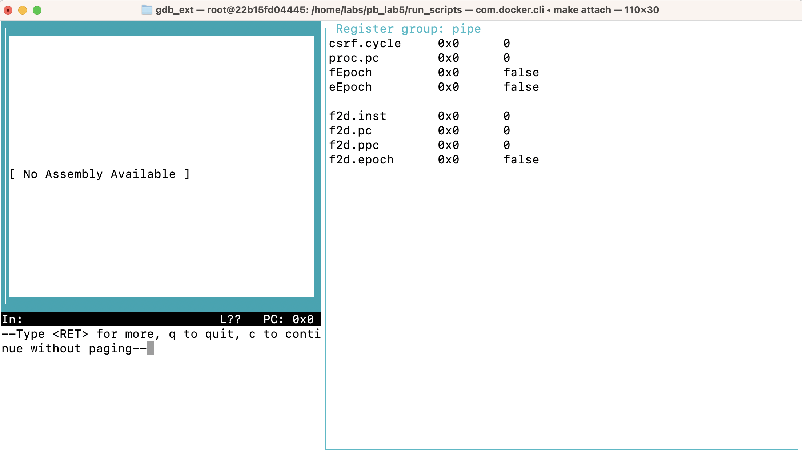
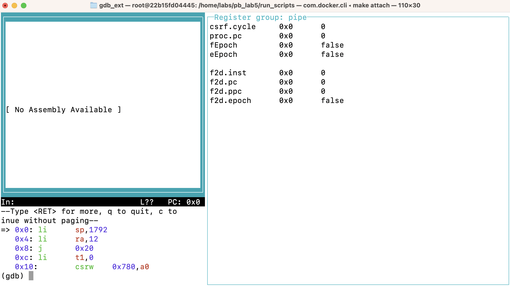
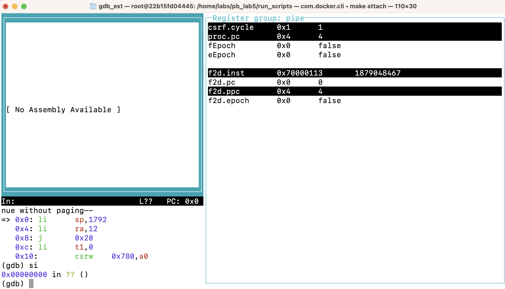
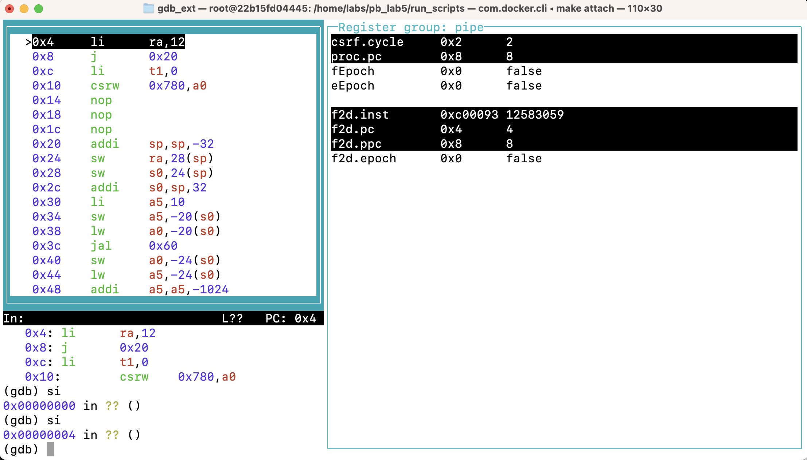
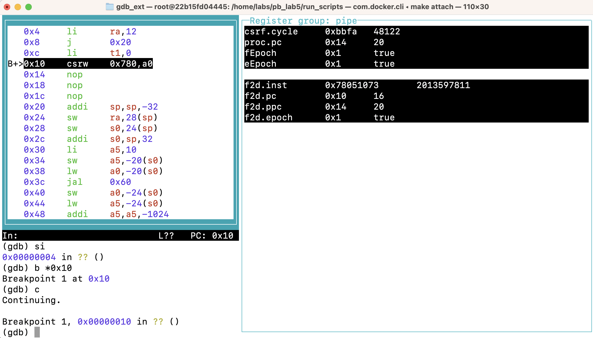
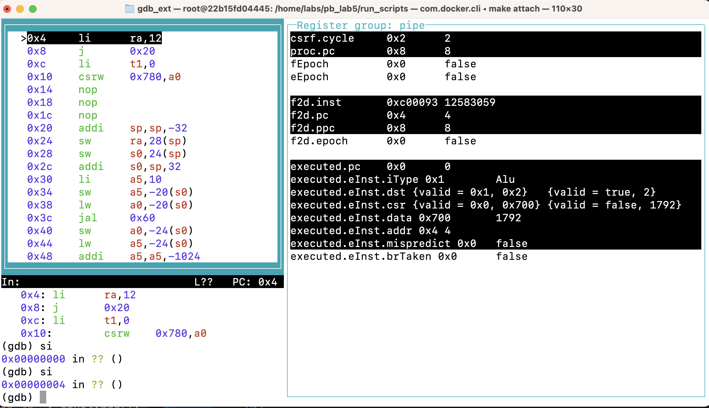

# Introduction
This tutorial demonstrates a pratical example of adding custom variables to be shown to the Bluespec RISC-V Processor Debugger.
By following this tutorial, you'll gain insights into the process of adding custom variables within the debugger interface and learn how to use the debugger.

## Table of Contents

[Getting Started: Running the Debugger](#getting-started-running-the-debugger)
[Understanding the Debugger Interface](#understanding-the-debugger-interface)
[Adding New Custom Variables](#adding-new-custom-variables)

## Getting Started: Running the Debugger
Before proceeding, ensure you have set up the necessary environment variables and ahve all the required libraries installed. If not, refer to the [Prerequisites](../README.md#prerequisites) section in the main README.

This tutorial will focus on debugging the `hanoi_tower` program in Lab 5. Follow these steps to run the debugger:

1. Navigate to the directory containing the run scripts for the lab:
```bash
cd labs/pb_lab5/run_scripts
```
2. Compile the processor using the `debug_compile.sh`:
```bash
./debug_compile.sh
```

3. In one terminal, start the processor:
```bash
./process_run.sh program-test hanoi_tower
```
4. In another terminal, start the debugger:
```bash
./gdb_run.sh
```

5. When the debugger starts, you'll see a similiar image as below. Press `Enter` to proceed and initiate the debugging session.


## Understanding the Debugger Interface
Upon starting the debugger, you'll see an image similiar to the one below. Initially, instructions at `0x0` are displayed only once on the terminal.



<br>
Execute the `step instruction (si)` command once to run a single cycle of the processor. Although the instructions are not visible in the asm layout, in the register layout, you can observe that the processor has started and has fetched the first instruction.


Execute `si` again. Now, you'll see the assembly codes int the asm layout.

<br>

You can set breakpoints using the `b *0x10` command, where `0x10` represents the desired breakpoint address.

<br>

Use the `continue` command to proceed with execution until the next breakpoint is reached.



## Adding New Custom Variables
Let's walk through the process of adding a new custom variable to be displayed in the debugger interface.
**1. Update Proc.bsv**
First, we need to define a new struct `Executed` in the `Proc.bsv` file. This struct will hold the result of the `exec` function.
```bsv
typedef struct {
  Addr pc;
  ExecInst eInst;
} Executed deriving(Bits, Eq);
```

Next, we'll declare a new register `executed` of type `Executed`:
```bsv
Reg#(Executed) executed <- mkRegU;
```

Then, within the `doRest` rule, we'll set the `executed` register to the result of the `exec` function:
Now in `rule doRest` add code to set `executed` to result of `exec`.
```bsv
let eInst = exec(dInst, rVal1, rVal2, pc, ppc, csrVal);  
executed <= Executed{pc:pc, eInst:eInst};
```

**2. Update debug_vars.xml**
Next, we'll update the `gdb/debug_vars.xml` file to include the new variable `executed`.

Add the following XML code to the file:
```xml
<data gdb_name="                                                                                                                                                           " bluespec_name="False" bluespec_type="Bool">
<data gdb_name="executed" bluespec_name="executed" bluespec_type="Executed">
```
The first XML data entry serves as a line break in the debugger interface, ensuring better readability. Then the `executed` variable is defined with its corresponding Bluespec name and type.

**3. Recompile and Rerun**
After making the necessary code changes, recompile the code in the debug mode and rerun the debugger.

**4. View the New Variable**
Once the debugger is running, you should see the new variable `executed` displayed in the debugger interface, along with its corresponding value.


